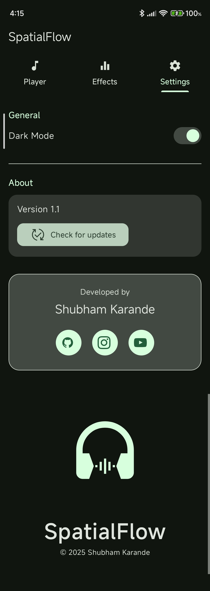

<p align="center">
  
</p>
<h1 align="center">SpatialFlow</h1>
<p align="center">
  A clean, immersive Android audio player built with Material Design 3, smooth animations, and built-in update support.
</p>
<p align="center">
  <b>Lightweight • Fast • Material You • Open Source</b>
</p>
<p align="center">
  
  
  
</p>

## Features

* Immersive audio playback with a modern UI
* Material Design 3 + Dynamic Colors
* Built-in update checker using GitHub Releases
* Local music playback (MP3 + Android-supported formats)

## Requirements

| Component | Version |
| :--- | :--- |
| **Min SDK** | 24 (Android 7.0+) |
| **Target SDK** | 35 (Android 15) |
| **Languages** | Java + Kotlin Stdlib |
| **Libraries** | AndroidX, Material Components, ViewBinding, FFmpeg Audio Kit 6.0.2 LTS|

## Installation

### Option 1 — Download (Recommended)

Download the latest APK from the Releases page:
**[https://github.com/MythicalSHUB/SpatialFlow/releases](https://github.com/MythicalSHUB/SpatialFlow/releases)**

> ⚠️ **Upgrading from v1.0.0?**
> Because of a signing key change, you must uninstall v1.0.0 once.
> All future updates will install smoothly.

### Option 2 — Build from Source

```bash
git clone [https://github.com/MythicalSHUB/SpatialFlow.git](https://github.com/MythicalSHUB/SpatialFlow.git)
cd SpatialFlow
```

1.  Open the project in Android Studio (JDK 17)
2.  Wait for Gradle to sync
3.  Build & run on device/emulator

## In-App Updater

SpatialFlow comes with a built-in updater that:

* Fetches the newest release from GitHub
* Allows you to download and update directly
* Uses the system installer for seamless updates

**How to use:**

* `Settings` → `Check for updates`

## Technical Overview

* **Architecture:** Single-module Android app
* **UI:** Material 3, ConstraintLayout, ViewBinding
* **Audio Engine:** Android Media APIs
* **Update System:** GitHub Releases API JSON parsing

<p >
  
  
  
</p>


## Versioning

SpatialFlow uses simple semantic versioning:
`vMajor.Minor.Patch`

Example: `v1.2`

## Contributing

Pull requests and feature suggestions are always welcome.
If you find a bug or want a new feature, open an **[Issue]**.

## Credits

Developed by **Shubham Karande**

Made with passion for clean UI, smooth audio, and modern Android design.
