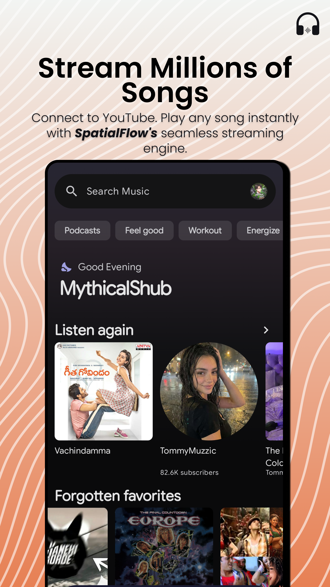
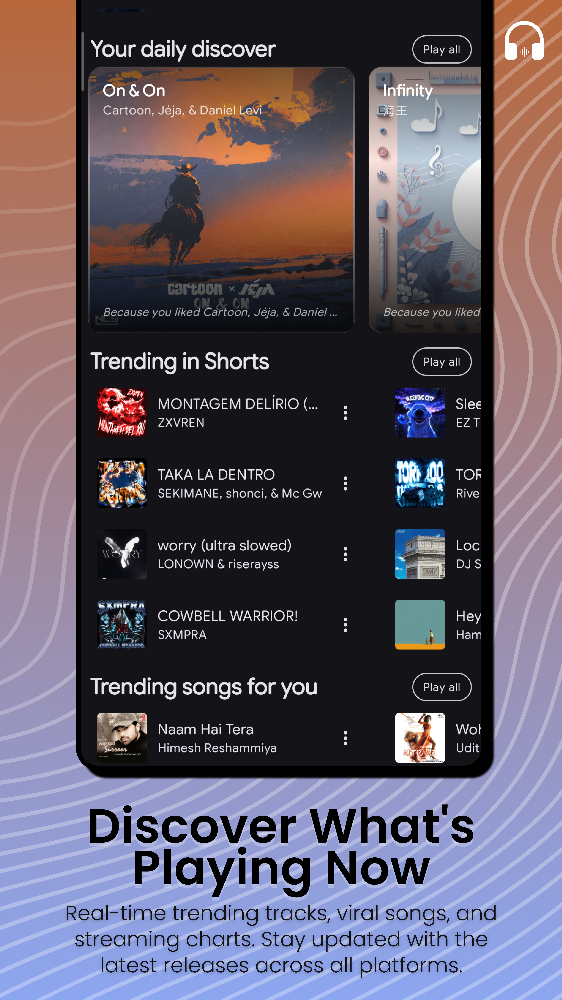
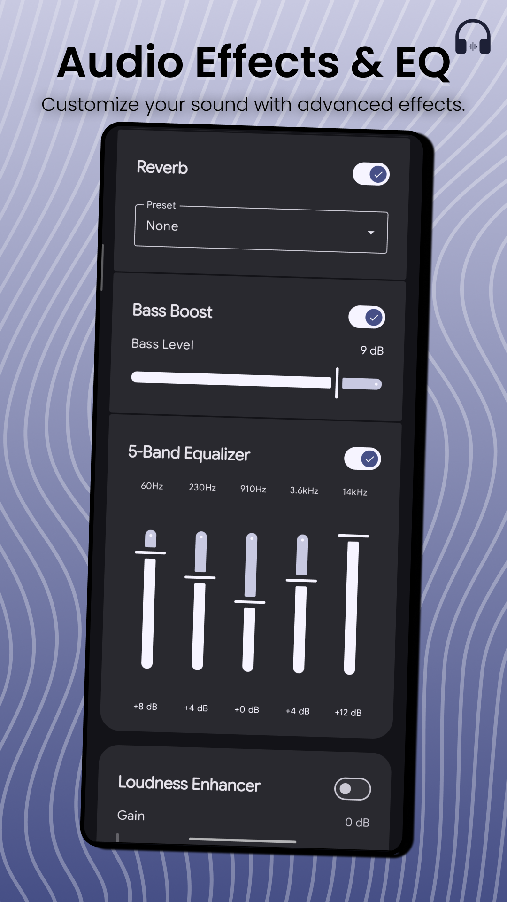
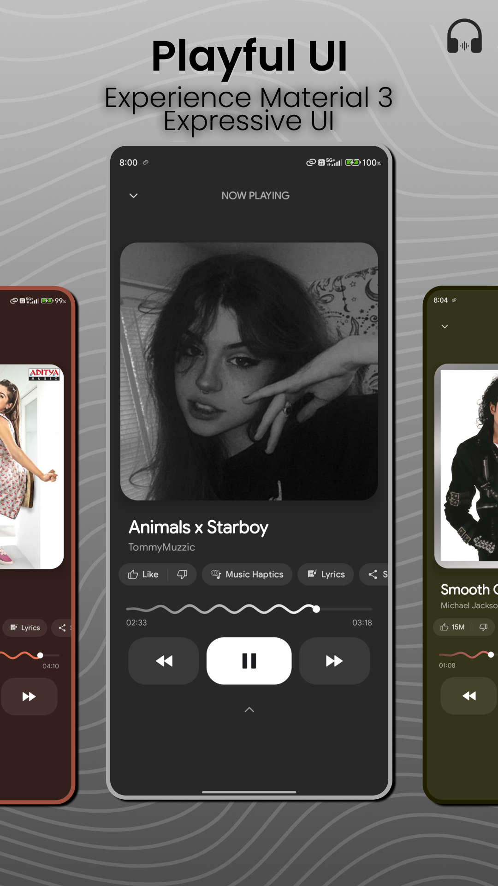
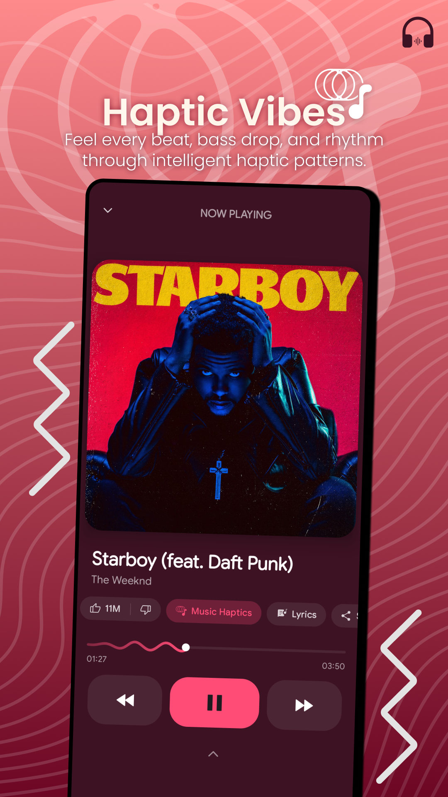
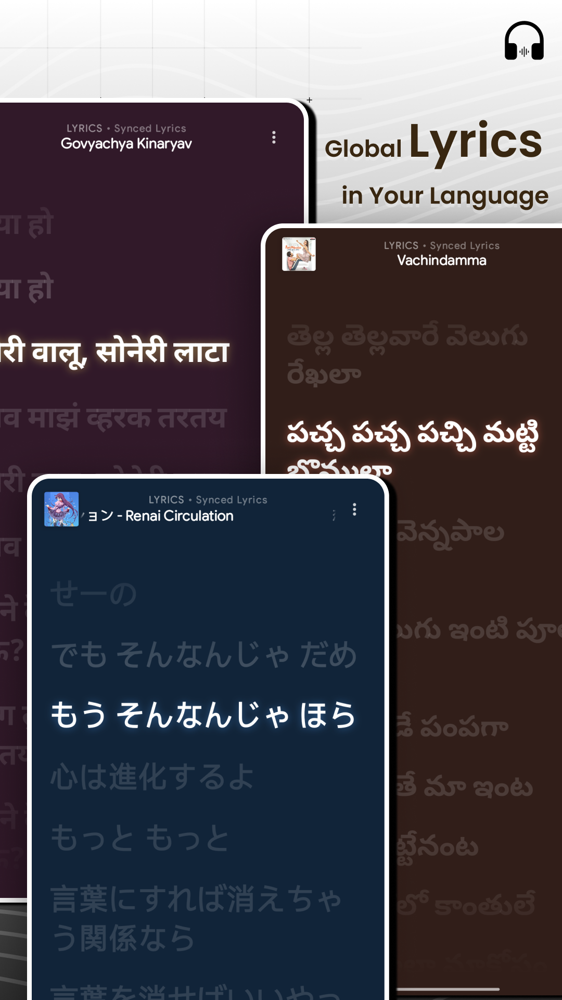
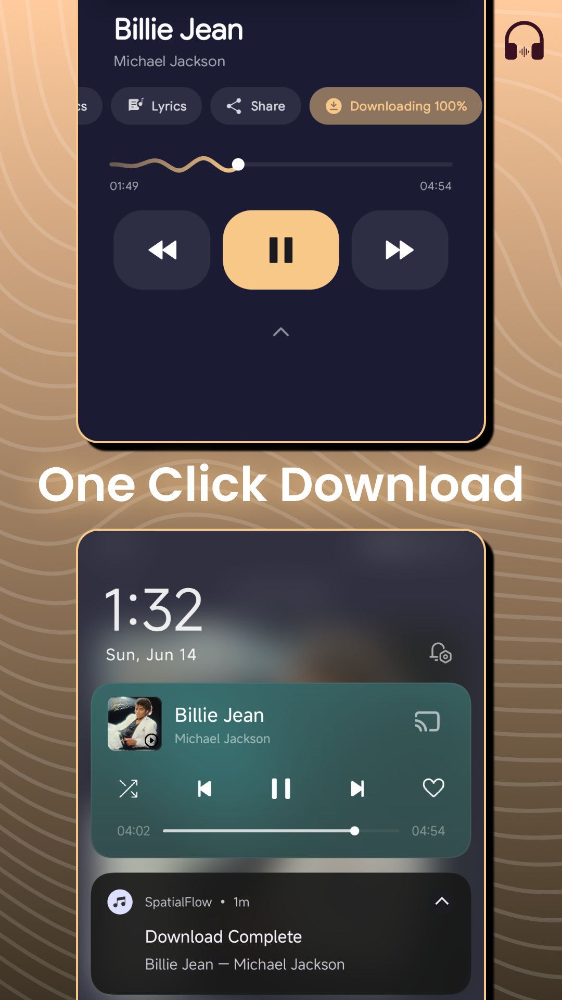

<p align="center">
  
</p>

<h1 align="center">SpatialFlow</h1>

<p align="center">
  A modern, unified Android music player built with Jetpack Compose, Material Design 3 Expressive, and advanced audio processing for local libraries and online streaming.
</p>

<p align="center">
  <b>Hybrid Streaming | New Expressive UI | Material You | Dynamic Theming | Volume Normalization | Open Source</b>
</p>

<p align="center">
  <a href="#about-spatialflow"><b>About</b></a> •
  <a href="#features"><b>Features</b></a> •
  <a href="#screenshots"><b>Screenshots</b></a> •
  <a href="#tech-stack--architecture"><b>Architecture</b></a> •
  <a href="#installation"><b>Download</b></a> •
  <a href="#community--support"><b>Community & Support</b></a>
</p>

<p align="center">
  
  
  
  
  
  <br/>
  
  
  
  
  <a href="https://t.me/SpatialFlow"></a>
  <a href="https://ko-fi.com/mythicalshub"></a>
</p>

---

## About SpatialFlow

**SpatialFlow** is a next-generation Android audio experience designed to seamlessly unify local music collections and online streaming into a single, cohesive application. Built natively with Kotlin and Jetpack Compose, it features an adaptive user interface that dynamically extracts colors from album artwork in real time to generate custom Material Design 3 Expressive themes.

Whether playing high-fidelity offline files from internal storage or streaming directly from YouTube Music, SpatialFlow delivers high-performance playback through AndroidX Media3 (ExoPlayer), integrated with studio-grade volume normalization, custom crossfading, multi-provider lyrics, and responsive system haptics.

---

## Features

### Hybrid Playback System
- **Local Storage Library:** High-speed storage scanner supporting MP3, FLAC, AAC, WAV, and standard Android audio formats.
- **Online Streaming:** Built-in InnerTube API (WebRemix) integration to search, browse, and stream audio directly from YouTube Music without requiring accounts.
- **Unified Queue Management:** Combine local audio files and online streams into a single playback queue.

### Advanced Audio Engineering
- **Real-Time Volume Normalization (LUFS):** On-the-fly gain analysis and calculation ensuring uniform loudness across offline and online tracks (Default target: -14 LUFS).
- **Custom Crossfade:** Smooth, configurable gapless transitions and overlapping fades between tracks.
- **Built-in Equalizer & Effects:** Multi-band equalizer with customizable presets, Bass Boost, Loudness Enhancer, and Environmental Reverb.

### Synchronized Lyrics & Player Canvas
- **Multi-Provider Lyrics Engine:** Automatic lyric fetching across multiple sources including YouLyPlus, LRCLIB, Paxsenix, and BetterLyrics.
- **Word-by-Word Karaoke:** High-precision TTML and LRC syllable sync rendering for line-by-line and word-by-word karaoke visualization.
- **Interactive Player Canvas:** Dynamic background visualizer and smooth canvas animations synced to audio playback.

### Premium Material Design 3 Expressive UI
- **Dynamic Color Engine:** Real-time color palette generation derived from active track artwork.
- **Modern UI Components:** Custom glassmorphism panels, spring-physics animations, fluid skeleton shimmers, and responsive layouts.
- **Appearance Customization:** Full support for pure dark (AMOLED) mode, custom accent themes, and dynamic navigation labels.

---

## Screenshots

<p align="center">
  
  
  
</p>
<p align="center">
  
  
  
</p>
<p align="center">
  
  
  
</p>
<p align="center">
  
  
  
</p>
<p align="center">
  
</p>

---

## Tech Stack & Architecture

| Layer | Technology |
| :--- | :--- |
| **Language** | Kotlin 1.9+ |
| **UI Toolkit** | Jetpack Compose (Material Design 3 Expressive) |
| **Architecture** | MVI (Model-View-Intent) Presentation Layer |
| **Media Engine** | AndroidX Media3 (ExoPlayer) |
| **Dependency Injection** | Koin for Android |
| **Networking** | Ktor Client + Coroutines & StateFlow |
| **Data Extraction** | InnerTube Models + NewPipe Extractor |

---

## Requirements

| Parameter | Minimum / Required |
| :--- | :--- |
| **Minimum SDK** | API 24 (Android 7.0 Nougat) |
| **Target SDK** | API 35 (Android 15) |
| **JDK Version** | Java Development Kit 17 |

---

## Installation

### Download Pre-Built APK
Download the latest APK release directly from GitHub:
[Download SpatialFlow Releases](https://github.com/MythicalSHUB/SpatialFlow/releases)

### Build from Source Code
```bash
git clone https://github.com/MythicalSHUB/SpatialFlow.git
cd SpatialFlow
```
1. Open the project in Android Studio (Koala edition or newer recommended).
2. Allow Gradle sync to download dependencies and setup the workspace.
3. Select an active device or emulator and run the `app` target.

---

## In-App Auto Updater

SpatialFlow includes an integrated update manager:
- Automatically checks GitHub Releases for new updates on launch.
- Provides one-tap direct APK download within the app.
- Seamless installation managed via Android Package Installer.

---

## Contributing

Contributions, bug reports, and feature requests are welcome:
1. Review open issues on the GitHub repository.
2. Fork the project repository and create a feature branch.
3. Submit a Pull Request detailing your changes.

---

## Community & Support

Join the official SpatialFlow community or support ongoing development:
- **Telegram Group:** [t.me/SpatialFlow](https://t.me/SpatialFlow) — Support, discussions, and updates.
- **Support Development:** [](https://ko-fi.com/mythicalshub) — Help keep the project open-source and active.
- **Pull Requests:** [](https://github.com/MythicalSHUB/SpatialFlow/pulls) — Contributions are always welcome!

---

## Credits & Acknowledgements

SpatialFlow is built upon open-source software and community projects:

- **[ArchiveTune](https://github.com/rukamori/ArchiveTune):** Foundation for the lyrics engine, player canvas, UI animations, and lyrics providers.
- **[InnerTune](https://github.com/z-huang/InnerTune):** Foundational architecture and core player model design.
- **[OuterTune](https://github.com/OuterTune/OuterTune):** Logic and structure for InnerTube API calls and streaming metadata retrieval.
- **[PixelPlayer](https://github.com/PixelPlayerHQ/PixelPlayer):** Design inspiration for the mini player layout and onboarding interface.
- **[Material Design 3](https://m3.material.io/):** Google's design system providing expressive UI components.

---

## Developer

**Shubham Karande**  
Focused on building modern, fluid, and open-source Android applications.

---

## License

This project is licensed under the MIT License - see the [LICENSE](LICENSE) file for details.

```text
MIT License

Copyright (c) 2026 Shubham Karande

Permission is hereby granted, free of charge, to any person obtaining a copy
of this software and associated documentation files (the "Software"), to deal
in the Software without restriction, including without limitation the rights
to use, copy, modify, merge, publish, distribute, sublicense, and/or sell
copies of the Software...
```

---

## Keywords

SpatialFlow, SpatialFlow Android App, Spatial Flow, Jetpack Compose Music Player, Material Design 3 Expressive, Material You Audio Player, Dynamic Color Theming, YouTube Music Streaming App, InnerTube API Client, YouTube Music Player Android, AndroidX Media3 Player, ExoPlayer Android, Open Source Spotify Alternative, Open Source YouTube Music Alternative, InnerTune Alternative, OuterTune Alternative, ViMusic Alternative, ArchiveTune, PixelPlayer, Kotlin Music Player, LUFS Normalization, ReplayGain Android, Audio Gain Calculation, Real-time Volume Normalizer, Custom Audio Crossfade, Gapless Playback, 5-Band Audio Equalizer, Bass Boost Android, Environmental Reverb, Loudness Enhancer, Word-by-Word Karaoke Lyrics, Syllable Synced Lyrics, TTML Lyrics Parser, LRC Lyrics Parser, YouLyPlus Provider, LRCLIB Lyrics, Paxsenix Lyrics, BetterLyrics Provider, Multi-Provider Lyrics Engine, Animated Player Canvas, Audio Visualizer Canvas, AMOLED Pure Black Dark Mode, Glassmorphism UI Android, Spring Physics Animations, MVI Architecture Compose, Koin Dependency Injection, Ktor HTTP Client, Offline Music Scanner, FLAC Lossless Player, MP3 Audio Player, AAC Audio Player, Unified Playback Queue, In-App Auto Updater, Android 15 Audio App, Open Source Android Media Player.
